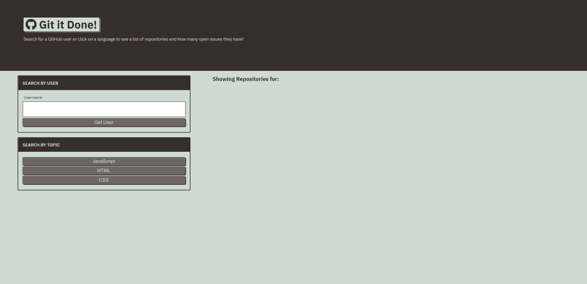

# Module 6

## CONTENTS OF THIS FILE

* Introduction
* Description
* Access
* Contribution
* Acknowledgement

## INTRODUCTION

UConn Bootcamp Module 6: Server-Side APIs 
Following UConn Bootcamp's tutorial guide to learn core server-side API skills by developing an application that helps users search GitHub by username or topic, and display matching projects along with the number of open issues they have. 
 
Built With:
- JavaScript
- Bootstrap
- jQuery
- APIs

## DESCRIPTION

Tutorial Lessons:

- Lesson 1: Get Started with Requests
    - Learn what a server-side API is.
    - Read server-side API documentation.
    - Use the browser's Fetch API to communicate with a server.
    - Inspect browser requests and server responses with the Chrome DevTools Network tab.
- Lesson 2: Display API Response Data
    - Collect user input to form HTTP requests.
    - Use an HTTP request's response to display data to the user.
    - Handle errors that may occur when working with server-side APIs.
- Lesson 3: Display Issues for Single Repositories
    - Define request and response headers
    - Use additional GitHub API endpoints
- Lesson 4: Query parameter
    - Pass information from one page to another using query parameters
    - Obtain data from a URL using browser-provided location objects
    - Make the API call dynamic by using the query parameter to alter the request
- Lesson 5: Adding Complex Queries
    - Use `data-`* attributes for the buttons.
    - Implement event delegation when clicking buttons.
    - Add query string parameters to the GitHub API’s URLs.
    - Recognize which options are available for GitHub API endpoints.
    - Use multiple parameters in a query string.
    - Use HTML attributes to dynamically update an API call.

## ACCESS
https://paperpatch.github.io/module-6/

Version edits and changes can be found in Github commit changes at https://github.com/paperpatch/module-6

## CONTRIBUTION
Made by Patrick Chen

## ACKNOWLEDGEMENT
UConn Bootcamp